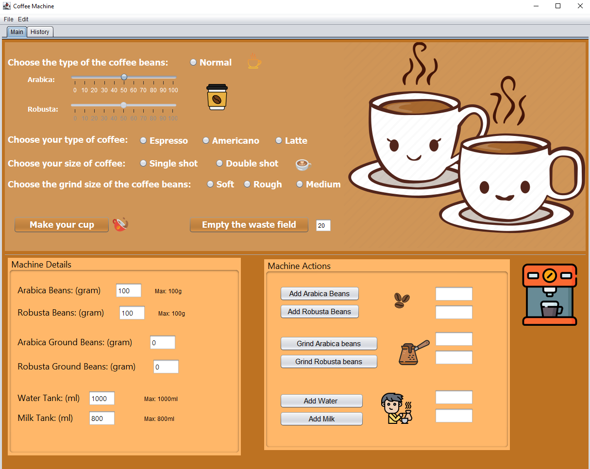

# Java Coffee Machine

A compleate coffee machine system that allow you to make your perfect cup of coffee easly!

## Learning Objectives

 - Java OOP
 - Encapsulation
 - Inheritance
 - Polymorphism
 - Abstraction
 - Handeling errors
 - GUI

## App Preview

